# Data Flow: From Python to Pixel

This document contains a Mermaid sequence diagram that illustrates the end-to-end journey of a data point (like `sentiment_score`) through the VibeAnalyst application.

```mermaid
sequenceDiagram
    participant PythonPipeline as "Python Pipeline (enrich_data.py)"
    participant EnrichedCSV as "Enriched CSV (enriched_data_*.csv)"
    participant AggregationScript as "Python Pipeline (aggregate_data.py)"
    participant SummaryCSV as "Summary CSV (post_summary_*.csv)"
    participant MigrationScript as "DB Migration (migrateRealData.ts)"
    participant Database as "PostgreSQL DB (via shared/schema.ts)"
    participant APIEndpoint as "Express API (server/routes.ts)"
    participant ReactQuery as "React Query Hook"
    participant SentimentChart as "React Component (SentimentChart.tsx)"
    participant User as "User"

    PythonPipeline->>EnrichedCSV: 1. Generates 'sentiment_score' for each comment and saves to CSV.
    AggregationScript->>SummaryCSV: 2. Aggregates comment scores into 'avg_sentiment_score' for each post and saves to a summary CSV.

    Note over MigrationScript, Database: The following steps populate the database, which is the intended production data source.
    MigrationScript->>SummaryCSV: 3. Reads post summary CSV files.
    MigrationScript->>Database: 4. Inserts post data, including 'avg_sentiment_score', into the 'posts' table.
    MigrationScript->>EnrichedCSV: 5. Reads enriched comment CSV files.
    MigrationScript->>Database: 6. Inserts individual comment data, including 'sentiment_score', into the 'comments' table.

    Note over APIEndpoint, ReactQuery: Currently, the API is configured to read directly from the CSV for performance, bypassing the database for this specific route.
    ReactQuery->>APIEndpoint: 7. Frontend hook requests data from the `/api/posts` endpoint.
    APIEndpoint->>SummaryCSV: 8. API reads 'avg_sentiment_score' directly from the summary CSV files.
    APIEndpoint-->>ReactQuery: 9. Returns post data as a JSON payload.
    ReactQuery-->>SentimentChart: 10. Provides the fetched data to the component.
    SentimentChart->>SentimentChart: 11. Processes the raw data to calculate monthly average sentiment scores.
    SentimentChart-->>User: 12. Renders the final sentiment trend chart on the user's screen.
```

